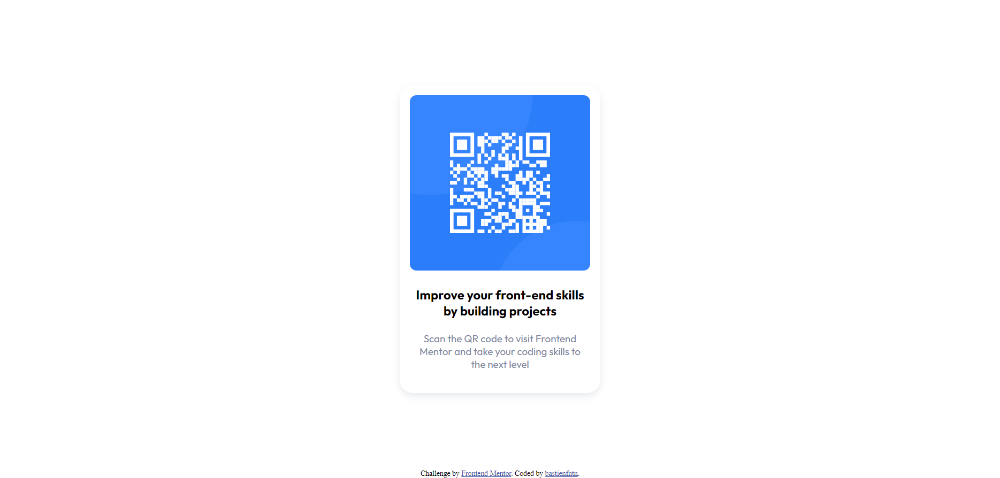

# Frontend Mentor - QR code component solution

This is a solution to the [QR code component challenge on Frontend Mentor](https://www.frontendmentor.io/challenges/qr-code-component-iux_sIO_H). Frontend Mentor challenges help you improve your coding skills by building realistic projects. 

## Table of contents

- [Overview](#overview)
  - [Screenshot](#screenshot)
- [My process](#my-process)
  - [Built with](#built-with)
  - [What I learned](#what-i-learned)
- [Author](#author)

**Note: Delete this note and update the table of contents based on what sections you keep.**

## Overview

### Screenshot

## My process

I started by creating the HTML structure and then I added the CSS styles. I started by creating the main container and gave him round corners. I added the QR code img inside of it and the text. I place the container in the center of the screen with absolute positionning. I added the background color and the shadow. I added the font for the text and made small aesthtics adjustements.

### Built with

- Semantic HTML5 markup
- CSS custom properties

### What I learned

I learned how to center a div in CSS with absolute positionning. I also learned how to use the box-shadow property.

## Author

- Frontend Mentor - [@bastienfntn](https://www.frontendmentor.io/profile/bastienfntn)
- Ghithub - [@bastienfntn](https://github.com/bastienfntn)
